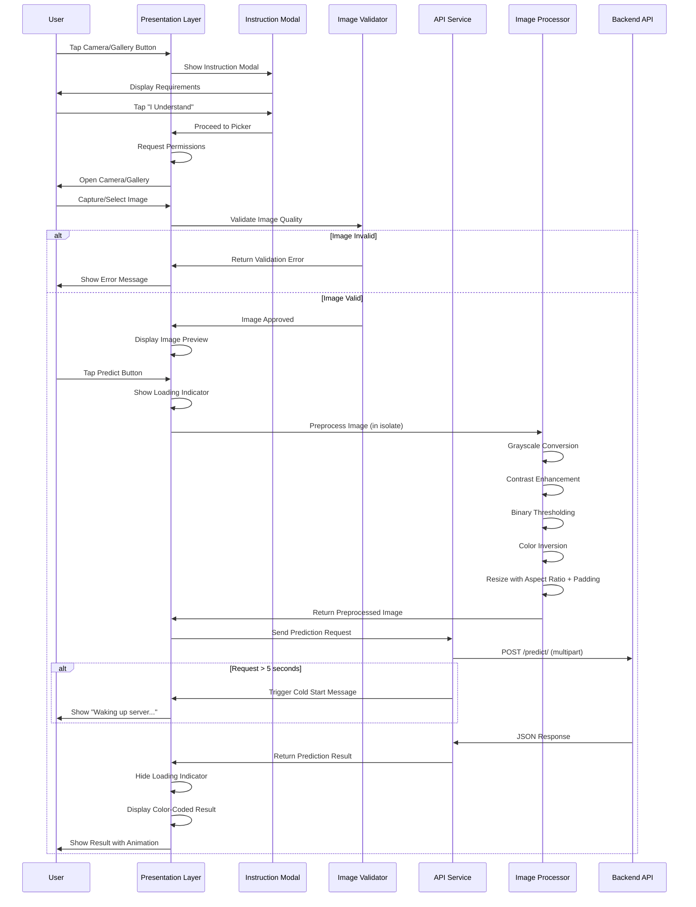

# Design Document: Dyslexia Detection Flutter App

## Overview

This document provides the technical design for a production-ready Flutter mobile application that enables dyslexia detection through handwriting analysis. The application captures or selects handwriting images, applies a 5-step preprocessing pipeline to match the expected model format, communicates with a deployed FastAPI backend for classification, and presents results with a clean, responsive user interface.

### System Context

The application serves as a mobile frontend for a machine learning-based dyslexia detection system. It bridges the gap between user-captured handwriting samples and a pre-trained classification model hosted on Hugging Face Spaces. The app handles the critical preprocessing steps required to transform raw camera images into the exact format expected by the model (64x256 grayscale images with white handwriting on black background).

### Key Design Goals

1. **Reliability**: Robust error handling and graceful degradation
2. **Usability**: Intuitive interface with clear feedback and loading states
3. **Maintainability**: Clean architecture with separation of concerns
4. **Performance**: Efficient image processing using isolates to prevent UI blocking
5. **Responsiveness**: Adaptive layout supporting various screen sizes
6. **Professional Quality**: Healthcare-appropriate visual design and user experience
7. **Input Quality**: Strict image validation to ensure model receives appropriate inputs
8. **User Guidance**: Clear instructions to help users provide quality handwriting samples

## Architecture

### High-Level Architecture

The application follows a layered architecture pattern with clear separation between presentation, business logic, and data layers:

```
┌─────────────────────────────────────────────────────────┐
│                  Presentation Layer                      │
│  (home_screen.dart, instruction_modal.dart,             │
│   widgets, state management)                            │
└─────────────────────────────────────────────────────────┘
                          │
                          ▼
┌─────────────────────────────────────────────────────────┐
│                   Service Layer                          │
│              (api_service.dart)                          │
└─────────────────────────────────────────────────────────┘
                          │
                          ▼
┌─────────────────────────────────────────────────────────┐
│                   Utility Layer                          │
│     (image_processor.dart, image_validator.dart)        │
└─────────────────────────────────────────────────────────┘
                          │
                          ▼
┌─────────────────────────────────────────────────────────┐
│              External Dependencies                       │
│  (image_picker, image package, http, device camera)     │
└─────────────────────────────────────────────────────────┘
```

### Architecture Layers

**Presentation Layer**
- Responsible for UI rendering, user interactions, and state management
- Implements the home screen with image preview, action buttons, and result display
- Manages loading states, error display, and animations
- Uses Flutter's setState or Provider for state management
- Handles permission requests and user feedback

**Service Layer**
- Encapsulates all HTTP communication with the backend API
- Constructs multipart/form-data requests with preprocessed images
- Parses JSON responses and extracts prediction results
- Implements timeout handling and error classification
- Provides a clean interface to the presentation layer

**Utility Layer**
- Implements the 5-step image preprocessing pipeline
- Validates images before preprocessing to ensure quality
- Handles image format conversions (color to grayscale)
- Applies contrast enhancement, thresholding, and color inversion
- Performs precise resizing with aspect ratio preservation and padding
- Runs preprocessing in isolates using compute() to prevent UI blocking
- Ensures image quality preservation throughout transformations

### Image Preprocessing Constraints

The dyslexia detection model has specific input requirements based on its training data:

**Model Training Context**:
- Trained on background-removed handwriting dataset
- Expects white handwriting on black background (inverted from typical)
- Optimized for clean, isolated handwriting samples
- Not trained on images with multiple objects, colored backgrounds, or complex scenes

**Why Strict Preprocessing is Required**:
- The model is sensitive to external objects in the frame
- Colored backgrounds or shadows can confuse the classifier
- Perspective distortion affects feature extraction
- The model expects normalized 64x256 pixel input with specific characteristics

**Implications for Design**:
- Image validation must reject unsuitable inputs before processing
- User instructions must clearly communicate requirements
- Preprocessing must transform diverse inputs into the exact expected format
- Error messages should guide users toward providing better samples

### Data Flow



### Technology Stack

- **Framework**: Flutter (Dart)
- **State Management**: Provider or setState
- **HTTP Client**: http package
- **Image Handling**: image_picker, image packages
- **Backend API**: FastAPI (Hugging Face Spaces)
- **Image Format**: JPEG/PNG for upload, processed to grayscale

## Components and Interfaces

### 1. InstructionModal (Presentation Layer)

**Responsibility**: Display pre-capture instructions to ensure users understand image requirements

**UI Components**:
- Modal overlay with semi-transparent background
- Title: "Image Capture Guidelines"
- Instruction list:
  - ✓ Only white paper visible
  - ✓ No pen or objects in frame
  - ✓ Good lighting (no shadows)
  - ✓ Dark handwriting (black/blue pen)
  - ✓ Entire text visible in frame
- Visual examples: Good vs Bad image samples
- "I Understand" button (primary action)
- Cannot be dismissed without tapping button

**State Management**:
- Track if user has seen instructions in current session
- Show modal on first camera/gallery access per session

### 2. HomeScreen (Presentation Layer)

**Responsibility**: Main UI component managing user interactions and application state

**State Variables**:
```dart
File? _selectedImage           // Currently selected/captured image
Uint8List? _preprocessedImage  // Processed image ready for API
bool _isLoading                // Loading state flag
bool _showColdStartMessage     // Cold start message visibility
String? _predictionLabel       // "Dyslexic" or "Non-Dyslexic"
double? _confidence            // Confidence score (0.0 to 1.0)
String? _errorMessage          // Error message to display
bool _hasSeenInstructions      // Session-based instruction tracking
```

**Key Methods**:
- `_showInstructionModal()`: Displays instruction modal before picker
- `_pickImageFromCamera()`: Opens device camera after instructions
- `_pickImageFromGallery()`: Opens gallery after instructions
- `_handleImageSelection(File image)`: Validates and processes selected image
- `_predictDyslexia()`: Orchestrates preprocessing and API call with cold start handling
- `_displayResult(PredictionResult result)`: Updates UI with prediction results
- `_handleError(Exception error)`: Classifies and displays error messages

**UI Components**:
- AppBar with title "Dyslexia Detection"
- Image preview container (displays selected or preprocessed image)
- Action buttons row (Camera, Gallery, Predict)
- Loading indicator overlay
- Cold start message ("Waking up server...")
- Result card with color-coded label and confidence
- Error message snackbar/alert

### 3. ImageValidator (Utility Layer)

**Responsibility**: Validates image quality before preprocessing

**Interface**:
```dart
class ImageValidator {
  static ValidationResult validateImage(File imageFile);
}

class ValidationResult {
  final bool isValid;
  final String? errorMessage;
  final ValidationFailureReason? reason;
}

enum ValidationFailureReason {
  tooManyColors,
  lowContrast,
  insufficientBrightness,
  invalidBlackPixelRatio,
}
```

**Validation Checks**:

**1. Color Variance Check**
```
Calculate color variance across image
If variance > threshold (indicating many colors):
  Reject with message: "Image has too many colors. Please use white paper with dark handwriting only."
```

**2. Contrast Check**
```
Calculate contrast ratio between darkest and lightest regions
If contrast < minimum_threshold:
  Reject with message: "Image has low contrast. Ensure good lighting and dark handwriting."
```

**3. Brightness Check**
```
Calculate average brightness across image
If brightness < minimum OR brightness > maximum:
  Reject with message: "Image brightness is unsuitable. Ensure proper lighting without overexposure."
```

**4. Black Pixel Ratio Check** (after thresholding simulation)
```
Apply threshold to count black vs white pixels
ratio = black_pixels / total_pixels
If ratio < 0.05 OR ratio > 0.80:
  Reject with message: "Image content ratio is unsuitable. Ensure handwriting fills frame appropriately."
```

**Implementation Notes**:
- Run validation before expensive preprocessing
- Provide specific, actionable error messages
- Use conservative thresholds to avoid false rejections
- Consider adding a "Skip Validation" option for advanced users (future enhancement)

### 4. ApiService (Service Layer)

**Responsibility**: Handles all HTTP communication with the backend API, including cold start detection

**Interface**:
```dart
class ApiService {
  static const String baseUrl = 'https://dibakarb-dyslexia-backend.hf.space';
  static const Duration timeout = Duration(seconds: 60);
  static const Duration coldStartThreshold = Duration(seconds: 5);
  
  Future<PredictionResult> predictDyslexia(
    Uint8List imageBytes,
    {Function? onColdStart}
  );
}
```

**Method: predictDyslexia**
- **Input**: 
  - `Uint8List imageBytes` - Preprocessed image as byte array
  - `Function? onColdStart` - Optional callback triggered after 5 seconds
- **Output**: `Future<PredictionResult>` - Prediction label and confidence
- **Process**:
  1. Start timer for cold start detection
  2. Create MultipartRequest with POST method
  3. Add image bytes as "file" field with filename "handwriting.jpg"
  4. Set appropriate headers (Content-Type: multipart/form-data)
  5. Send request with 60-second timeout
  6. If 5 seconds elapse without response, trigger onColdStart callback
  7. Parse JSON response: `{"prediction": 0/1, "label": "...", "confidence": 0.xx}`
  8. Return PredictionResult object
- **Error Handling**:
  - SocketException → Network unavailable error
  - TimeoutException → Timeout error (extended to 60s for cold starts)
  - HTTP 500+ → Server error
  - HTTP 400-499 → Client error
  - JSON parsing errors → Invalid response error

**Cold Start Handling**:
```dart
// Pseudo-code for cold start detection
Timer coldStartTimer = Timer(Duration(seconds: 5), () {
  if (!requestCompleted && onColdStart != null) {
    onColdStart(); // Trigger UI message
  }
});

// Cancel timer when response received
coldStartTimer.cancel();
```

### 5. ImageProcessor (Utility Layer)

**Responsibility**: Implements the 5-step preprocessing pipeline in an isolate

**Interface**:
```dart
class ImageProcessor {
  static Future<Uint8List> preprocessImage(File imageFile);
  
  // Internal method that runs in isolate
  static Uint8List _preprocessInIsolate(String imagePath);
}
```

**Usage Pattern**:
```dart
// Called from UI layer - automatically runs in isolate
final preprocessed = await compute(
  ImageProcessor._preprocessInIsolate,
  imageFile.path
);
```

**Method: preprocessImage**
- **Input**: `File imageFile` - Original captured/selected image
- **Output**: `Future<Uint8List>` - Preprocessed image bytes (64x256, grayscale)
- **Execution**: Runs in isolate via `compute()` to prevent UI blocking
- **Processing Pipeline**:

**Step 1: Grayscale Conversion**
```
For each pixel (r, g, b):
  gray = 0.299*r + 0.587*g + 0.114*b
```
Uses luminosity method for perceptually accurate grayscale conversion.

**Step 2: Contrast Enhancement**
```
For each pixel value p:
  enhanced = ((p - 128) * contrastFactor) + 128
  clamped = clamp(enhanced, 0, 255)
```
Applies contrast factor of 1.5 to improve handwriting visibility.

**Step 3: Binary Thresholding**
```
threshold = 128
For each pixel value p:
  binary = p > threshold ? 255 : 0
```
Converts to pure black and white for clear handwriting separation.

**Step 4: Color Inversion**
```
For each pixel value p:
  inverted = 255 - p
```
Produces white handwriting on black background as expected by model.

**Step 5: Aspect Ratio Preserving Resize with Padding**
```
targetWidth = 256
targetHeight = 64

// Calculate scaling to fit within target while preserving aspect ratio
scaleWidth = targetWidth / originalWidth
scaleHeight = targetHeight / originalHeight
scale = min(scaleWidth, scaleHeight)

newWidth = originalWidth * scale
newHeight = originalHeight * scale

// Resize with bilinear interpolation
resized = resize(image, newWidth, newHeight, interpolation=BILINEAR)

// Calculate padding needed
padLeft = (targetWidth - newWidth) / 2
padRight = targetWidth - newWidth - padLeft
padTop = (targetHeight - newHeight) / 2
padBottom = targetHeight - newHeight - padTop

// Add black padding to reach exact 64x256
final = addPadding(resized, padLeft, padRight, padTop, padBottom, color=BLACK)
```

**Critical: Aspect Ratio Preservation**
- **Why**: Stretching images distorts letter shapes, degrading model accuracy
- **Strategy**: Scale to fit within 64x256, then pad with black pixels
- **Example**: 1000x400 image → scale height to 64 → width becomes 160 → pad left/right with 48 pixels each to reach 256
- **Padding Color**: Black (0, 0, 0) to match inverted background

**Implementation Notes**:
- Use `image` package for all transformations
- Process in isolate using `compute()` to avoid blocking UI
- Return JPEG-encoded bytes for efficient transmission
- Ensure exact 64x256 output dimensions
- Preserve aspect ratio to prevent letter distortion

### 6. Data Models

**PredictionResult**
```dart
class PredictionResult {
  final int prediction;      // 0 or 1
  final String label;        // "Dyslexic" or "Non-Dyslexic"
  final double confidence;   // 0.0 to 1.0 (corresponds to predicted class)
  
  PredictionResult({
    required this.prediction,
    required this.label,
    required this.confidence,
  });
  
  factory PredictionResult.fromJson(Map<String, dynamic> json) {
    return PredictionResult(
      prediction: json['prediction'],
      label: json['label'],
      confidence: json['confidence'].toDouble(),
    );
  }
  
  Color getResultColor() {
    return label == "Non-Dyslexic" ? Colors.green : Colors.red;
  }
  
  String getConfidencePercentage() {
    return "${(confidence * 100).toStringAsFixed(1)}%";
  }
}
```

**Note on Confidence**: The confidence value must correspond to the predicted class probability. If the model predicts "Dyslexic", the confidence should reflect the probability of dyslexia, not the probability of the alternative class.

### 7. Permission Handler

**Responsibility**: Manages camera and storage permissions

**Implementation Strategy**:
- Use `image_picker` built-in permission handling
- Provide fallback messages when permissions are denied
- Guide users to settings if permissions are permanently denied

**Permission Flow**:
```
1. User taps camera/gallery button
2. Check if permission already granted
3. If not granted, request permission
4. If denied, show explanation dialog
5. If permanently denied, show settings navigation dialog
6. If granted, proceed with image selection
```

## Data Models

### Image Data Flow

**Original Image** → **Validation** → **Preprocessed Image** → **API Request** → **Prediction Result**

1. **Original Image**: File object from camera/gallery (any size, color)
2. **Validation**: Check color variance, contrast, brightness, pixel ratios
3. **Preprocessed Image**: Uint8List (64x256, grayscale, inverted, aspect-ratio preserved)
4. **API Request**: Multipart form data with "file" field
5. **Prediction Result**: JSON with prediction, label, confidence

### Non-Functional Requirements

**Performance Targets**:
- **API Response Time**: < 5 seconds (excluding cold start)
- **Cold Start Time**: 10-30 seconds (Hugging Face Spaces limitation)
- **Preprocessing Time**: < 1 second on mid-range devices
- **Memory Usage**: < 150MB during normal operation
- **UI Responsiveness**: No frame drops during processing (achieved via isolates)

**Rationale**:
- Isolate usage prevents UI thread blocking during image processing
- Cold start handling manages user expectations for serverless deployment
- Memory limits ensure compatibility with budget Android devices
- Response time targets balance accuracy with user experience

### System Limitations

The application and underlying model have inherent limitations that users should understand:

**Model Limitations**:
- **Not robust to multiple objects**: Model expects isolated handwriting only
- **Requires white backgrounds**: Trained on white paper samples
- **Sensitive to shadows**: Shadows can be misinterpreted as handwriting
- **Sensitive to perspective distortion**: Angled or skewed images reduce accuracy
- **Requires clean samples**: Smudges, erasures, or poor quality reduce accuracy

**Application Assumptions**:
- Users will follow instruction modal guidelines
- Users have access to white paper and dark writing instruments
- Users can capture images in adequate lighting conditions
- Users understand this is a screening tool, not a diagnostic tool

**Mitigation Strategies**:
- Instruction modal educates users before capture
- Image validation rejects obviously unsuitable images
- Clear error messages guide users toward better samples
- Documentation emphasizes limitations and appropriate use cases

### Future Enhancements

**Security Improvements** (not in current scope):
- API key authentication to prevent abuse
- Rate limiting per device/user
- Request signing to prevent tampering
- HTTPS certificate pinning

**Model Improvements** (requires retraining):
- Robustness to varied backgrounds
- Multi-object scene handling
- Perspective correction
- Adaptive thresholding based on lighting conditions

**User Experience Improvements**:
- Real-time camera preview with quality indicators
- Automatic image quality assessment with visual feedback
- History of past predictions
- Export results as PDF report

### State Management Model

Using Provider pattern (recommended) or setState:

**AppState** (if using Provider):
```dart
class AppState extends ChangeNotifier {
  File? selectedImage;
  Uint8List? preprocessedImage;
  bool isLoading = false;
  PredictionResult? result;
  String? errorMessage;
  
  void setSelectedImage(File image) { ... }
  void setLoading(bool loading) { ... }
  void setResult(PredictionResult result) { ... }
  void setError(String message) { ... }
  void clearError() { ... }
}
```

### Error Classification Model

```dart
enum ErrorType {
  networkUnavailable,
  timeout,
  serverError,
  invalidImage,
  invalidResponse,
  permissionDenied,
  unknown
}

class AppError {
  final ErrorType type;
  final String message;
  final String? technicalDetails;
  
  String getUserMessage() {
    switch (type) {
      case ErrorType.networkUnavailable:
        return "No internet connection. Please check your network.";
      case ErrorType.timeout:
        return "Request timed out. Please try again.";
      case ErrorType.serverError:
        return "Server error. Please try again later.";
      case ErrorType.invalidImage:
        return "Invalid image. Please select a clear handwriting sample.";
      case ErrorType.permissionDenied:
        return "Permission denied. Please enable camera/storage access.";
      default:
        return "An error occurred. Please try again.";
    }
  }
}
```


## Correctness Properties

*A property is a characteristic or behavior that should hold true across all valid executions of a system—essentially, a formal statement about what the system should do. Properties serve as the bridge between human-readable specifications and machine-verifiable correctness guarantees.*

### Property Reflection

After analyzing all acceptance criteria, the following redundancies were identified and resolved:

- **Loading State Properties (7.1-7.5)**: Properties about loading activation and deactivation can be combined into comprehensive properties.
- **Color Coding (6.4, 6.5)**: These are specific examples that can be combined into a single property about label-to-color mapping.
- **Image Processing Pipeline (2.1-2.7)**: While each step is distinct, we can create properties that validate the pipeline produces the expected output format with aspect ratio preservation.
- **Permission Handling (1.5, 12.5)**: Both relate to permission handling and can be addressed in a single property about permission flow.
- **Error Handling (8.1-8.4)**: These are specific error examples that demonstrate a general property about error classification and messaging.
- **Validation Checks (3.1-3.4)**: Can be combined into properties about validation logic.
- **Instruction Modal (4.1-4.3)**: Can be combined into properties about modal display and user flow.

### Property 1: Instruction Modal Precedes Image Capture

*For any* camera or gallery button tap, the app should display the instruction modal before opening the picker, and the picker should only open after the user taps "I Understand".

**Validates: Requirements 4.1, 4.2, 4.3**

### Property 2: Image Selection Updates Preview State

*For any* image selected via camera or gallery, the app state should update to display that image in the preview container, and the preview should remain visible until a new image is selected or the app is reset.

**Validates: Requirements 1.3**

### Property 3: Picker Cancellation Preserves State

*For any* app state, canceling the camera or gallery picker should return the app to that exact state without modifying any state variables or causing errors.

**Validates: Requirements 1.4**

### Property 4: Permission Request Precedes Feature Access

*For any* camera or gallery access attempt, the app should verify or request the appropriate permission before invoking the system picker, and should handle denial gracefully.

**Validates: Requirements 1.5, 12.5**

### Property 5: Image Validation Rejects Unsuitable Images

*For any* image that fails validation checks (excessive colors, low contrast, poor brightness, or invalid pixel ratios), the validator should reject the image and provide a specific error message explaining the failure reason.

**Validates: Requirements 3.1, 3.2, 3.3, 3.4, 3.5**

### Property 6: Grayscale Conversion Produces Monochrome Output

*For any* color image, after grayscale conversion, every pixel should have equal R, G, and B values (R = G = B), confirming true grayscale representation.

**Validates: Requirements 2.1**

### Property 7: Contrast Enhancement Increases Dynamic Range

*For any* grayscale image, contrast enhancement should increase the standard deviation of pixel values, indicating greater separation between light and dark regions.

**Validates: Requirements 2.2**

### Property 8: Binary Thresholding Produces Pure Black and White

*For any* contrast-enhanced image, after binary thresholding, every pixel value should be either 0 or 255, with no intermediate gray values.

**Validates: Requirements 2.3**

### Property 9: Color Inversion is Bijective

*For any* binary image, inverting colors twice (invert then invert again) should produce the original image, confirming perfect inversion: invert(invert(image)) = image.

**Validates: Requirements 2.4**

### Property 10: Resize Preserves Aspect Ratio and Produces Exact Dimensions

*For any* inverted image with dimensions W×H, after aspect-ratio-preserving resize with padding, the output should be exactly 64×256 pixels, and the aspect ratio of the non-padded content should match the original image's aspect ratio (W/H).

**Validates: Requirements 2.5**

### Property 11: Preprocessing Runs in Isolate

*For any* image preprocessing operation, the processing should execute in an isolate (via compute()), and the UI thread should remain responsive during the entire operation.

**Validates: Requirements 2.7**

### Property 12: Preprocessing Pipeline Output Format

*For any* valid input image, the complete preprocessing pipeline should produce an output that is: (1) exactly 64x256 pixels, (2) grayscale (R=G=B for all pixels), (3) binary (all pixels are 0 or 255), and (4) inverted (white content on black background).

**Validates: Requirements 2.1, 2.2, 2.3, 2.4, 2.5**

### Property 13: API Request Uses Correct Multipart Structure

*For any* preprocessed image, the API request should use POST method, multipart/form-data content type, include the image in a field named "file", and target the correct endpoint URL.

**Validates: Requirements 5.1, 5.2, 5.3**

### Property 14: Cold Start Message Displays After Threshold

*For any* API request that exceeds 5 seconds without response, the app should display the "Waking up server..." message to inform the user about cold start delays.

**Validates: Requirements 5.6**

### Property 15: JSON Response Parsing Extracts All Fields

*For any* valid JSON response containing prediction, label, and confidence fields, the parser should successfully extract all three values and construct a valid PredictionResult object.

**Validates: Requirements 5.4, 5.5**

### Property 16: Prediction Label Display Reflects Result

*For any* PredictionResult received, the UI should display the exact label string from the result, making it visible to the user.

**Validates: Requirements 6.1**

### Property 17: Confidence Corresponds to Predicted Class

*For any* PredictionResult, the confidence value should correspond to the probability of the predicted class, not the alternative class.

**Validates: Requirements 6.3**

### Property 18: Confidence Score Formatted as Percentage

*For any* PredictionResult with confidence value c (0.0 to 1.0), the displayed confidence should be formatted as a percentage in the range 0% to 100%, calculated as c × 100.

**Validates: Requirements 6.2**

### Property 19: Result Color Mapping

*For any* PredictionResult, if the label is "Non-Dyslexic" then the result display color should be green, and if the label is "Dyslexic" then the result display color should be red.

**Validates: Requirements 6.4, 6.5**

### Property 20: Result Display Triggers Animation

*For any* PredictionResult received, displaying the result should trigger a fade-in animation on the result container.

**Validates: Requirements 6.6**

### Property 21: Loading State Activation on Predict

*For any* predict button tap, the app should simultaneously: (1) display the loading indicator, (2) disable the predict button, and (3) set a flag preventing additional API calls.

*For any* predict button tap, the app should simultaneously: (1) display the loading indicator, (2) disable the predict button, and (3) set a flag preventing additional API calls.

**Validates: Requirements 7.1, 7.2, 7.3**

### Property 22: Loading State Deactivation on Completion

*For any* API request completion (success or error), the app should simultaneously: (1) hide the loading indicator and (2) re-enable the predict button.

**Validates: Requirements 7.4, 7.5**

### Property 23: Error Classification and Messaging

*For any* error type (network, timeout, server, invalid image, validation failure), the app should classify the error correctly and display an appropriate user-friendly message that matches the error type.

**Validates: Requirements 8.1, 8.2, 8.3, 8.4**

### Property 24: Error Logging

*For any* error that occurs during API communication, image processing, or validation, the app should log the error details (type, message, stack trace) for debugging purposes.

**Validates: Requirements 8.5**

### Property 25: Graceful Error Handling

*For any* error condition (network failure, invalid input, API error, permission denial, validation failure), the app should handle it without crashing, display appropriate feedback, and allow the user to retry or take corrective action.

**Validates: Requirements 8.6**

### Property 26: Portrait Orientation Rendering

*For any* screen size in portrait orientation (width < height), the app should render all UI components without overflow errors or layout exceptions.

**Validates: Requirements 9.5, 9.6**

### Property 27: Button Styling Consistency

*For any* interactive button in the app, it should have rounded corners (border radius > 0), maintaining visual consistency.

**Validates: Requirements 11.3**

### Property 28: Preprocessing Performance Target

*For any* image on a mid-range device, the preprocessing operation should complete in less than 1 second.

**Validates: Requirements 13.3**

### Property 29: UI Responsiveness During Processing

*For any* image processing or API call operation, the UI should remain responsive and not freeze, with frame rates maintained above 30 FPS.

**Validates: Requirements 13.4, 13.5**

## Error Handling

### Error Classification Strategy

The application implements a comprehensive error classification system that maps technical exceptions to user-friendly messages:

**Network Errors**
- **Detection**: `SocketException`, `NetworkException`
- **User Message**: "No internet connection. Please check your network and try again."
- **Recovery**: Allow retry after network restoration

**Timeout Errors**
- **Detection**: `TimeoutException`, HTTP request exceeds 60 seconds
- **User Message**: "Request timed out. The server is taking too long to respond. Please try again."
- **Recovery**: Allow immediate retry
- **Note**: Timeout extended to 60 seconds to accommodate cold starts

**Image Validation Errors**
- **Detection**: ValidationResult with isValid = false
- **User Messages** (specific to failure reason):
  - Too many colors: "Image has too many colors. Please use white paper with dark handwriting only."
  - Low contrast: "Image has low contrast. Ensure good lighting and dark handwriting."
  - Insufficient brightness: "Image brightness is unsuitable. Ensure proper lighting without overexposure."
  - Invalid pixel ratio: "Image content ratio is unsuitable. Ensure handwriting fills frame appropriately."
- **Recovery**: Prompt user to capture/select different image
- **Detection**: `TimeoutException`, HTTP request exceeds 30 seconds
- **User Message**: "Request timed out. The server is taking too long to respond. Please try again."
- **Recovery**: Allow immediate retry

**Server Errors**
- **Detection**: HTTP status codes 500-599
- **User Message**: "Server error occurred. Please try again later."
- **Recovery**: Allow retry with exponential backoff suggestion

**Client Errors**
- **Detection**: HTTP status codes 400-499
- **User Message**: "Invalid request. Please ensure you've selected a valid handwriting image."
- **Recovery**: Prompt user to select a different image

**Image Processing Errors**
- **Detection**: Exceptions during preprocessing pipeline
- **User Message**: "Unable to process image. Please select a clear photo of handwriting."
- **Recovery**: Prompt user to select a different image

**Permission Errors**
- **Detection**: Permission denial from system
- **User Message**: "Camera/storage permission required. Please enable in settings."
- **Recovery**: Provide button to open app settings

**Unknown Errors**
- **Detection**: Any unclassified exception
- **User Message**: "An unexpected error occurred. Please try again."
- **Recovery**: Allow retry and log full details

### Error Handling Implementation

**Try-Catch Blocks**
- Wrap all async operations (API calls, image processing) in try-catch
- Catch specific exception types first, then general exceptions
- Always clean up resources (close streams, dispose controllers)

**Error Propagation**
- Service layer throws typed exceptions
- Presentation layer catches and classifies exceptions
- Display errors via SnackBar or AlertDialog

**Logging Strategy**
- Log all errors with timestamp, error type, and stack trace
- Use Flutter's `debugPrint` for development
- Consider integration with crash reporting service (Firebase Crashlytics) for production

**User Feedback**
- Show errors immediately via SnackBar for transient issues
- Use AlertDialog for errors requiring user action
- Provide clear action buttons (Retry, Cancel, Open Settings)
- Never show technical error messages to users

### Error Recovery Patterns

**Retry Logic**
- Allow immediate retry for network and timeout errors
- Suggest waiting before retry for server errors
- Limit retry attempts to prevent infinite loops

**State Recovery**
- Preserve selected image after errors
- Reset loading state on error
- Clear error messages when user takes action

**Graceful Degradation**
- App remains functional after errors
- User can select new image and retry
- No data loss on error

## Testing Strategy

### Dual Testing Approach

The application requires both unit testing and property-based testing to ensure comprehensive coverage and correctness:

**Unit Tests**: Verify specific examples, edge cases, and integration points
**Property Tests**: Verify universal properties across randomized inputs

This dual approach ensures that specific scenarios are validated while also confirming that general rules hold across all possible inputs.

### Unit Testing Strategy

**Scope**: Specific examples, edge cases, error conditions, and integration points

**Test Categories**:

1. **Instruction Modal Tests**
   - Test modal display on first camera/gallery access
   - Test "I Understand" button enables picker
   - Test modal cannot be dismissed without button tap
   - Example: "First camera tap shows instruction modal"

2. **Image Validation Tests**
   - Test validation with images having excessive colors
   - Test validation with low contrast images
   - Test validation with poor brightness
   - Test validation with invalid pixel ratios
   - Test specific error messages for each failure type
   - Example: "Image with 50 colors fails validation"
   - Example: "Low contrast image shows appropriate error"

3. **Widget Tests** (Presentation Layer)
   - Test specific user interactions (button taps, image selection)
   - Test UI state updates for known inputs
   - Test error message display for specific error types
   - Test loading indicator visibility during operations
   - Test cold start message display after 5 seconds
   - Test color coding for specific prediction labels
   - Example: "Tapping camera button shows instruction modal first"
   - Example: "Displaying 'Dyslexic' result shows red color"

4. **Service Layer Tests** (API Communication)
   - Test API request construction with sample images
   - Test JSON parsing with known response payloads
   - Test cold start callback triggering after 5 seconds
   - Test error handling for specific HTTP status codes (404, 500, 503)
   - Test timeout handling with 60-second threshold
   - Example: "500 status code produces server error message"
   - Example: "Request exceeding 5 seconds triggers cold start callback"

5. **Image Processing Tests**
   - Test each preprocessing step with sample images
   - Test aspect ratio preservation with known dimensions
   - Test padding calculation for various aspect ratios
   - Test edge cases: very small images, very large images, pure black/white images
   - Test dimension validation (output is exactly 64x256)
   - Test grayscale conversion with known RGB values
   - Example: "1000x400 image scales to 64x160 then pads to 64x256"
   - Example: "Aspect ratio 2.5:1 is preserved in non-padded content"

6. **Integration Tests**
   - Test complete flow from instruction modal to result display
   - Test validation failure recovery flow
   - Test error recovery flows
   - Test permission request flows
   - Example: "Complete prediction flow with mock API and validation"

**Unit Test Guidelines**:
- Focus on specific, concrete examples
- Test edge cases that property tests might miss
- Test integration between components
- Keep tests fast and isolated
- Use mocks for external dependencies (API, camera, gallery)

### Property-Based Testing Strategy

**Scope**: Focus on core logic properties - image processing pipeline, JSON parsing, state transitions

**Testing Framework**: Use `test` package with custom property test helpers, or integrate a property-based testing library for Dart

**Configuration**:
- Minimum 100 iterations per property test
- Each test tagged with: **Feature: dyslexia-detection-flutter-app, Property {number}: {property_text}**

**Focused Property Test Categories**:

1. **Image Processing Properties** (Core Focus)
   - **Property 6**: Grayscale conversion (generate random color images, verify R=G=B)
   - **Property 7**: Contrast enhancement (generate random grayscale images, verify increased std dev)
   - **Property 8**: Binary thresholding (generate random images, verify only 0 or 255)
   - **Property 9**: Color inversion bijection (generate random binary images, verify double inversion)
   - **Property 10**: Aspect ratio preservation (generate random dimensions, verify aspect ratio maintained in content)
   - **Property 12**: Complete pipeline (generate random images, verify all format requirements)

2. **Data Transformation Properties**
   - **Property 15**: JSON parsing (generate random valid JSON responses, verify extraction)
   - **Property 18**: Confidence formatting (generate random confidence values 0.0-1.0, verify percentage)
   - **Property 17**: Confidence corresponds to predicted class (generate random results, verify consistency)

3. **State Transition Properties**
   - **Property 2**: Image selection updates state (generate random images, verify state update)
   - **Property 3**: Cancellation preserves state (generate random states, verify preservation)
   - **Property 21**: Loading activation (generate random app states, verify all loading flags set)
   - **Property 22**: Loading deactivation (generate random completion events, verify flags cleared)

4. **Validation Logic Properties**
   - **Property 5**: Image validation (generate random images with varying characteristics, verify correct accept/reject decisions)

**Simplified Approach**:
- Use widget tests for UI rendering, button styling, color coding, and layout
- Use unit tests for specific examples and edge cases
- Reserve property tests for core algorithmic logic that benefits from randomized input testing
- This reduces test complexity while maintaining comprehensive coverage

**Property Test Implementation Pattern**:
```dart
// Example property test structure
test('Feature: dyslexia-detection-flutter-app, Property 9: Color inversion is bijective', () {
  for (int i = 0; i < 100; i++) {
    // Generate random binary image
    final image = generateRandomBinaryImage();
    
    // Apply double inversion
    final inverted = ImageProcessor.invertColors(image);
    final doubleInverted = ImageProcessor.invertColors(inverted);
    
    // Verify bijection property
    expect(doubleInverted, equals(image));
  }
});
```

**Random Input Generators**:
- `generateRandomColorImage()`: Random dimensions, random RGB values
- `generateRandomGrayscaleImage()`: Random dimensions, R=G=B values
- `generateRandomBinaryImage()`: Random dimensions, only 0 or 255 values
- `generateRandomPredictionResult()`: Random label and confidence
- `generateRandomErrorType()`: Random error from defined types
- `generateRandomScreenDimensions()`: Random width/height in portrait

### Test Coverage Goals

- **Line Coverage**: Minimum 80% for all layers
- **Branch Coverage**: Minimum 75% for error handling paths
- **Property Coverage**: 100% of defined correctness properties
- **Edge Case Coverage**: All identified edge cases from requirements

### Testing Tools and Dependencies

```yaml
dev_dependencies:
  flutter_test:
    sdk: flutter
  mockito: ^5.4.0           # For mocking dependencies
  test: ^1.24.0             # Core testing framework
  integration_test:          # For integration tests
    sdk: flutter
```

### Continuous Testing

- Run unit tests on every commit
- Run property tests on every pull request
- Run integration tests before release
- Monitor test execution time and optimize slow tests
- Maintain test documentation with examples

